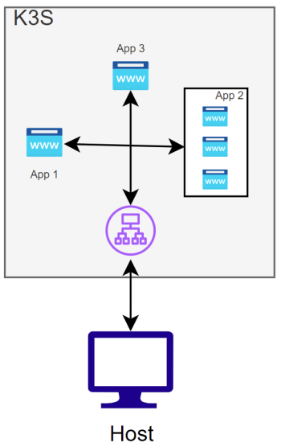

# Inception of Things

Initiation à Kubernetes avec K3s et K3d.

Le sujet est disponible dans les ressources.

## p1

Setup de deux clusters K3s avec un controller et un worker.

```bash
vagrant up --provider virtualbox
```

## p2

Setup d'un cluster K3s avec un déploiement de 3 application web comme représenté dans le schéma ci-dessous.



`app1.com` et `app2.com` seront redirigés respectivement sur `app1` et `app2`.
Le reste des urls saisies seront redirigés vers `app3`

```bash
vagrant up --provider virtualbox
```

## p3

Déploiement d'un argocd en utilisant un cluster K3d

```bash
vagrant up --provider virtualbox

# sans Vagrant
bash scripts/install-without-vagrant.sh
```

## bonus

Le bonus comprend la p3 avec en plus un Gitlab et la création de certificat avec Let's Encrypt.

Le script `replace-dm.sh` dans le dossier `scripts` permet de changer l'adresses mail et les noms de domaine utilisé pour configure le Let's Encrypt.

```bash
bash scripts/bonus.sh
```
